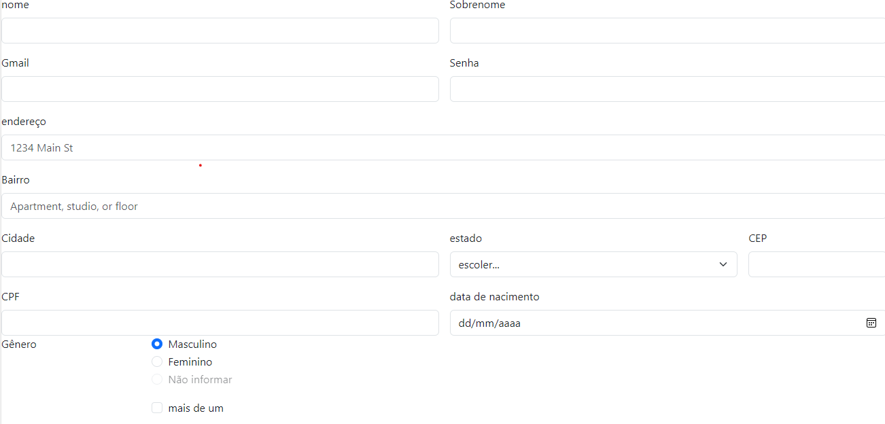

## saite de cadastro para compras onlai

### dados utilizados  
 para esse site for presisso pessquisar treis saites diferentes como shooping, shen,saite da nike, fazer o cadrastro para ver o que eles pedem para se cadrastrar é apartir de esses dados foi criado um sit com os mesmos requisitos. 
 

 ## Requisitos do cadastro

 # Dados pessoais
 
 * Nome
 * Sobrenome
 * data de nacimento
 * genéro
 *  email
 * CPF
 * senha
 # Dados  de endereço 
 
 * endereço 
 *  CEP
 * bairro 
 * cidade
 * estado
 

 ### Tambem os elementos sempre utilizados para criar um saite e ums novos 
 
 * HTML
 * CSS
 * imput 
 * label 
 * h1,h2 e h3
 * div
 * select
 * option
 * buton

 para criar essa estructura foi usado de num saite que tem varios tipos de formularios e te insina o que faz cada elemento e o que significa, si quiser uasarlo o nome do site o link esta aqui.
 ## bootstrap.5
 * link: https://getbootstrap.com/docs/5.0/getting-started/introduction/